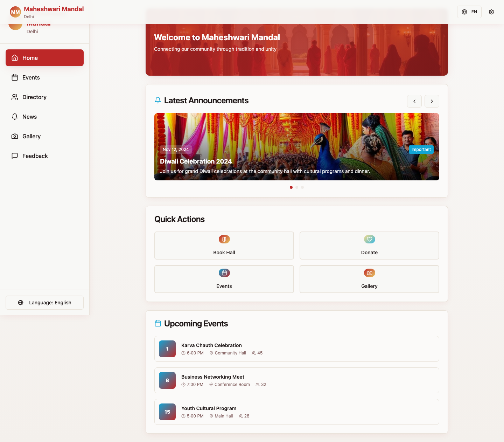
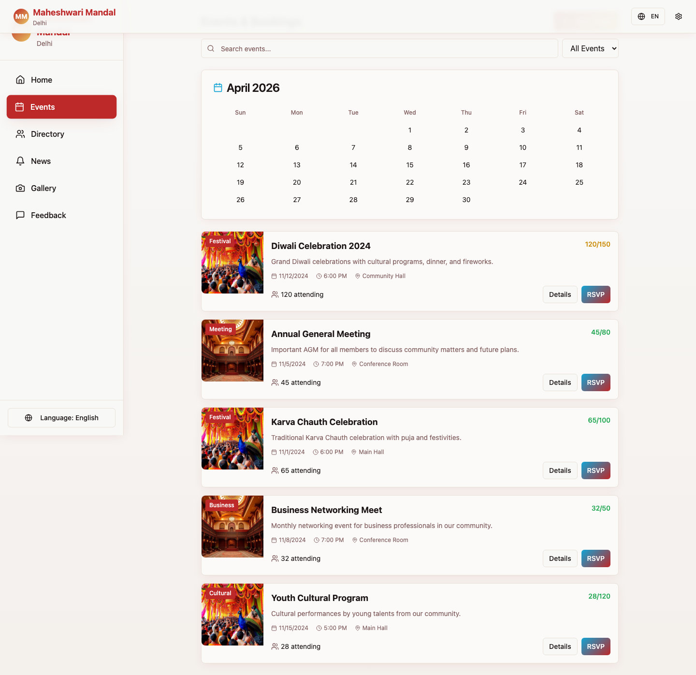
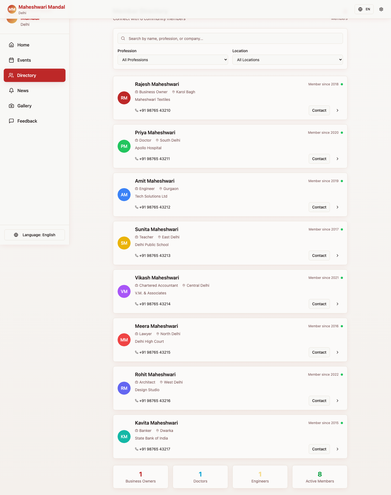
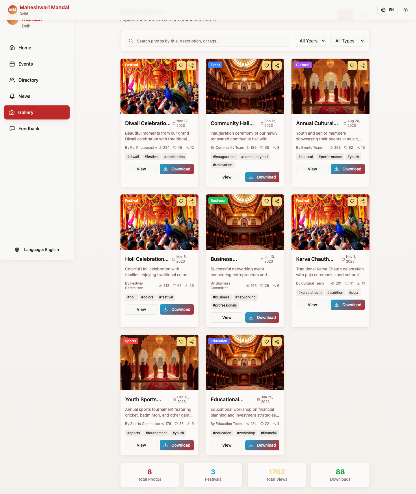
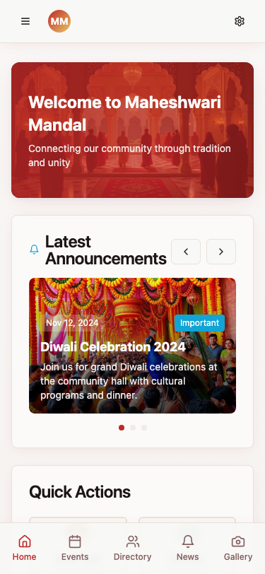

# 🌱 Mandal Digital Roots
**A Modern Gateway to Digital Heritage**

[](https://reactjs.org/)
[](https://ui.shadcn.com/)
[](https://opensource.org/licenses/MIT)

**Mandal Digital Roots** is a sophisticated web platform designed to preserve and showcase digital heritage. Built with React and TypeScript, it offers a seamless experience for exploring roots, connections, and stories.

## ✨ Visual Showcase

### 🖥️ Desktop Experience
| 🏠 Landing Page | 📅 Events & Activities |
| :---: | :---: |
|  |  |

| 👥 Member Directory | 📸 Community Gallery |
| :---: | :---: |
|  |  |

### 📱 Mobile View
| 📱 Responsive Design |
| :---: |
|  |

## 🎨 UI/UX Audit

| Pillar | Status | Notes |
| :--- | :---: | :--- |
| **Visual Hierarchy** | ✅ Pass | Clear distinction between headings, navigation, and content cards. |
| **Visual Style** | ✅ Pass | Consistent branding with `shadow-elegant` and cultural color palettes. |
| **Accessibility** | ⚠️ Warn | Semantic markup is strong; contrast ratios look good but should be verified. |
| **Responsiveness** | ✅ Pass | Full mobile support with a clean bottom navigation pattern. |

## 🚀 Deployment

This project is automatically built and deployed to **GitHub Pages** on every push to the `main` branch.

## 📦 How to run locally

1. Clone the repository:
   ```bash
   git clone https://github.com/ayushxx7/mandal-digital-roots.git
   ```
2. Install dependencies:
   ```bash
   npm install
   ```
3. Start the development server:
   ```bash
   npm run dev
   ```

## 🏷️ Release
This project is licensed under the **MIT License** - see the [LICENSE](LICENSE) file for details.

---
*Built with ❤️ for Digital Heritage.*
